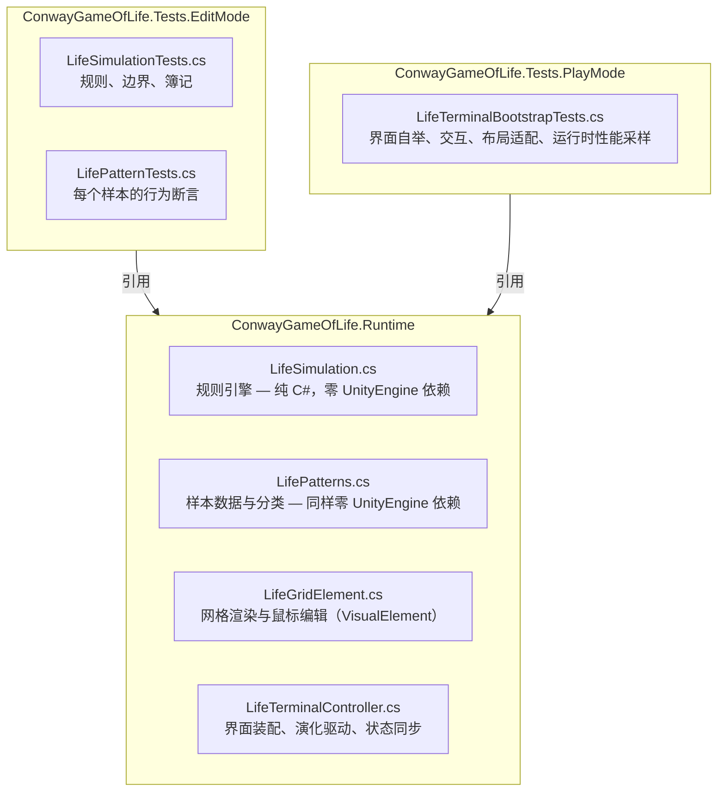
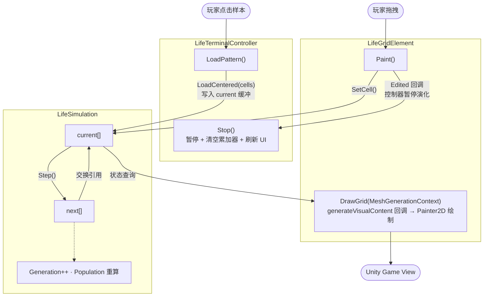

# 实现文档

本文说明代码如何组织、数据如何流动，以及如何扩展。

---

## 1. 模块划分



三个 subgraph 各对应一个 Assembly Definition 文件：`Runtime` 允许引用 `UnityEngine`，`Tests.EditMode` 仅在编辑器下编译，`Tests.PlayMode` 覆盖运行时行为。

**关于"纯 C#"这条边界，需要准确地说明它由什么保证：**

- **它是一条源码级约定，不是程序集级的强制隔离。** `ConwayGameOfLife.Runtime` 这一个程序集同时包含规则代码和 UI 代码，因此它**确实引用 `UnityEngine`**（`LifeGridElement` 继承 `VisualElement`）。程序集定义**没有**、也无法阻止 `LifeSimulation.cs` 去 `using UnityEngine`。
- **真正的保证来自 `.verify/` 工具**：那个 .NET 工程直接链接 `LifeSimulation.cs` 与 `LifePatterns.cs` 两份源码，在**没有 UnityEngine 程序集**的环境下编译。只要这两个文件里出现任何 `UnityEngine` 引用，`.verify` 立刻编译失败。
- 也就是说：**跨平台可测试性是被持续验证的**（每次跑 `.verify` 都在验证），而"程序集层面强制隔离"这个说法是**不成立**的，本文档此前对它的表述过度了。

若要把这条边界提升为程序集级强制，正确做法是拆出第三个程序集（例如 `ConwayGameOfLife.Core`，只含规则与样本、`noEngineReferences: true`），再由 Runtime 引用它。当前没有这么做，因为两个文件的规模还不足以承担额外的程序集开销。

---

## 2. 数据流



关键点：**数据是单向流动的**。`LifeGridElement` 只读取 `LifeSimulation`，唯一的写入路径是 `Paint()`（用户编辑），并通过 `Edited` 回调通知控制器。视图层不持有任何演化状态。

---

## 3. 各模块详解

### 3.1 `LifeSimulation` — 规则引擎

```csharp
public sealed class LifeSimulation
{
    private byte[] current;      // 当前代
    private byte[] next;         // 下一代（写入目标）

    public int Width { get; }
    public int Height { get; }
    public int Generation { get; private set; }
    public int Population { get; private set; }
    public bool WrapEdges { get; set; }
}
```

| 成员 | 职责 |
|---|---|
| `Step()` | 推进一代：遍历全部格子 → 交换缓冲 → 更新世代与存活数 |
| `IsAlive(x, y)` | 越界返回 `false`，调用方无需自行判界 |
| `SetCell(x, y, alive)` | 增量维护 `Population`；越界静默忽略；重复写入同值不计数 |
| `Clear()` | 清空两块缓冲，世代归零 |
| `LoadCentered(cells)` | 计算样本包围盒，居中放置到棋盘，并重置世代 |
| `Randomize(p, random)` | 按概率播种；`Random` 由外部注入以便测试可复现 |

两个设计决定值得说明：

**一、`Population` 是增量维护的。** `SetCell` 只在状态真正翻转时增减计数，`Step` 在循环中累加。因此读取 `Population` 是 O(1)，而不是每次 O(W·H) 重新统计——UI 每个世代都要读它。

**二、`Randomize` 接收 `Random` 参数而非内部 `new Random()`。** 这样测试可以传入固定种子得到确定结果。控制器则传入 `new System.Random()` 以获得真正的随机播种。

### 3.2 `LifePatterns` — 样本数据

```csharp
public enum LifePatternKind
{
    StillLife,           // 周期 1
    Oscillator,          // 周期 2
    PeriodicOscillator,  // 周期 ≥ 3
    Spaceship            // 周期性平移
}

public sealed class LifePattern
{
    public string Name { get; }          // 中文名
    public string EnglishName { get; }   // 英文名
    public LifePatternKind Kind { get; }
    public int Period { get; }
    public LifeCell[] Cells { get; }     // 相对坐标
}
```

样本以**相对坐标**存储，由 `LoadCentered` 负责居中——样本定义与棋盘尺寸解耦，同一份数据可以放到 64×40 或 96×64 的棋盘上。

`Period` 是**声明值**，其正确性由 `LifePatternTests` 逐项断言。声明与实际行为不会脱节。

### 3.3 `LifeGridElement` — 渲染与编辑

继承 `VisualElement`，用 UI Toolkit 的 `Painter2D` 立即模式绘制。

```csharp
generateVisualContent += DrawGrid;   // 重绘回调
```

绘制流程：

1. 用背景色填充整个 `contentRect`
2. 计算格子边长：`min(可用宽 / 列数, 可用高 / 行数)`，取较小值保证格子为正方形
3. 计算棋盘居中偏移
4. 逐格填充（活细胞与死细胞用不同颜色）
5. 描一个高亮边框

编辑交互：`PointerDown` 时记录"取反后的目标状态"（而非简单置活），随后 `PointerMove` 沿路径持续涂抹同一状态——这样既能画也能擦，且拖动过程中不会反复翻转同一格。指针捕获 (`CapturePointer`) 保证拖出元素后仍能继续绘制。

`TryGetCell` 把屏幕坐标反算为格子坐标，并对 `simulation == null` 与格子边长 ≤ 0（元素尚未布局）做了防护。

### 3.4 `LifeTerminalController` — 装配与驱动

**自举机制**：

```csharp
[RuntimeInitializeOnLoadMethod(RuntimeInitializeLoadType.BeforeSceneLoad)]
private static void Bootstrap()
{
    if (FindAnyObjectByType<LifeTerminalController>() != null) return;
    GameObject host = new("Life Terminal");
    DontDestroyOnLoad(host);
    host.AddComponent<LifeTerminalController>();
}
```

场景中无需预先摆放任何物体，任意场景按 Play 都能启动。`FindAnyObjectByType` 检查避免重复创建。

**界面构建**：全部在 `Awake()` 中用 C# 代码构建，不依赖 UXML 资产。`PanelSettings` 也在运行时 `CreateInstance`，缩放模式为 `ScaleWithScreenSize`，`screenMatchMode` 为 `MatchWidthOrHeight`（`match = 0.5`），参考分辨率 **1600×900（16:9）**。这样做的好处是项目里没有需要维护的 UI 资产文件，界面即代码。

**演化驱动**：

```csharp
accumulator += Time.unscaledDeltaTime;
float interval = 1f / speedSlider.value;
while (accumulator >= interval)
{
    accumulator -= interval;
    simulation.Step();
    RefreshReadouts();
}
```

用**累加器**而非"每帧一步"，让演化速率与渲染帧率解耦：请求 5 代/秒就是 5 代/秒，无论游戏跑 60 还是 144 帧。用 `unscaledDeltaTime` 使速率不受 `Time.timeScale` 影响。`while` 而非 `if` 让慢帧时能补上欠下的世代（但速率过高时仍会受帧率上限约束）。

**状态同步**：`Stop()` 统一处理"暂停 + 清空累加器 + 刷新 UI"。任何会改变棋盘的操作（载入样本、随机、清空、手动编辑）都先调用 `Stop()`——避免在演化中途改变棋盘导致状态不自洽。

---

## 4. 界面布局

```mermaid
%%{init: {"flowchart": {"wrappingWidth": 320}}}%%
flowchart TB
    subgraph HEADER["header"]
        H1["生命演算所 · ● 演算进行中<br/>CONWAY'S GAME OF LIFE / FIELD STATION 04"]
    end

    subgraph MACHINE["machine — 仪器外壳"]
        SB["top-line：LIFE TERMINAL · MODEL 1970 ｜ CELLULAR AUTOMATA / B3 · S23"]
        subgraph WORKSPACE["workspace — 横向两栏"]
            DISP["display<br/>screen-bar：样本 05 / 脉冲星 · PULSAR ｜ 96 × 64 / LIVE FIELD<br/><br/>life-grid（Painter2D 自绘网格）<br/><br/>readouts：GENERATION / 世代 ｜ POPULATION / 存活 ｜ STATE / 状态"]
            LIB["library（固定 236px）<br/>样本档案<br/>SPECIMEN ARCHIVE / 08 ENTRIES<br/><br/>preset-scroll：8 个样本按钮<br/><br/>dropdown：边界条件"]
        end
        CTL["controls：［▶ 运行］［▸ 单步］［↺ 重置］ ｜ 速率 ──●── ｜ ［随机播种］［清空］"]
    end

    subgraph FOOTER["footer"]
        F1["实验记录 / LIFE–001 ｜ 生命，始于简单的规则。"]
    end

    HEADER ~~~ MACHINE ~~~ FOOTER
    SB ~~~ WORKSPACE ~~~ CTL
```



> 上图表达**从属关系与排列顺序**：根元素 `.app` 下依次是 `header` / `machine` / `footer`；`machine` 内为 `top-line` → `workspace` → `controls`；`workspace` 是 `display` 与 `library` 两栏并排。
> **像素比例无法用 Mermaid 表达**——`library` 固定 236px，其余宽度全部归 `display`。真实观感见 `Screenshots/` 下的实机截图。

样式在 `Assets/Resources/LifeTerminal.uss`，采用终端机/仪器面板的视觉隐喻（金属外壳、暗色屏幕、琥珀色读数）。使用 USS 变量集中定义调色板：

```css
:root {
    --background: rgb(41, 43, 48);
    --ink: rgb(39, 43, 43);
    --metal: rgb(104, 119, 113);
    --paper: rgb(214, 213, 187);
    --mint: rgb(159, 197, 175);
    --amber: rgb(219, 187, 121);
}
```

`LifeRuntimeTheme.tss` 是主题入口，仅包含 `@import url("unity-theme://default");`，用于给 `PanelSettings` 提供默认控件样式基线。

---

## 5. 如何扩展

### 添加一个新样本

在 `LifePatterns.All` 中追加一项即可，测试会自动覆盖它（`Archive_CoversEveryRequiredCategory` 与各行为测试都遍历整个数组）：

```csharp
new("信标", "BEACON", LifePatternKind.Oscillator, 2,
    new(0, 0), new(1, 0), new(0, 1), new(1, 1),
    new(2, 2), new(3, 2), new(2, 3), new(3, 3)),
```

若坐标来自 RLE，用 `.verify` 工具解码，不要手工转录：

```powershell
dotnet run --project .verify -c Release -- probe
```

界面上的样本按钮数量与档案计数会自动跟随 `LifePatterns.All.Length`，无需改动 UI 代码。

### 调整棋盘尺寸

修改 `LifeTerminalController` 顶部常量：

```csharp
private const int GridWidth = 96;
private const int GridHeight = 64;
```

`screenBar` 上的尺寸标签会随常量自动更新。

### 更换渲染方式

`LifeGridElement` 是唯一接触绘制 API 的类。若要把逐格绘制改为纹理上传，只需重写 `DrawGrid`，其余代码不受影响——控制器只通过 `Bind`、`MarkDirtyRepaint` 和 `Edited` 三个接口与之交互。

### 接入不同的演化速率控制

`Update()` 中的累加器逻辑是唯一的时间源。若需要"每帧固定代数"或"按物理时间推进"，改动集中在这一个方法内。

---

## 6. 构建与验证命令

```powershell
# 编译（批处理模式，检查脚本错误）
unity run .

# 运行 EditMode 测试
unity test . --mode EditMode --output test-results.xml

# 独立校验（不启动 Unity）
dotnet run --project .verify -c Release                # 全部样本周期
dotnet run --project .verify -c Release -- rules       # 引擎 vs 独立参考实现
dotnet run --project .verify -c Release -- bench       # 性能基准
```

`unity run .` 会以 `-batchmode -quit` 启动编辑器；成功时退出码为 0，日志写入 `Logs/Editor.log`。检查脚本错误：

```powershell
Select-String -Path Logs\Editor.log -Pattern 'error CS|USS parsing error'
```
